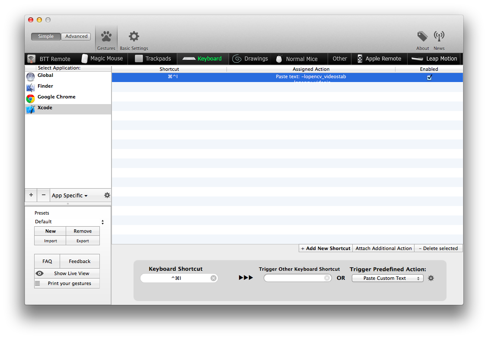

# XcodeOpenCV.popclipext

XCode で OpenCV の other_linker_flags を設定する PopClip 拡張

## TODO

- [x] Xcode がアクティブになってる時だけ動作するようにする
- [ ] ショートカットで動作するように (Xcode のショートカットとバッティングしないかを確認)

## まとめ

一応作ったが、BTT で指定テキストをはりつけるアクションを定義した方が楽という結論に至る

下記は、⌘+^+I で other_linker_flags のテキストを貼り付ける例

